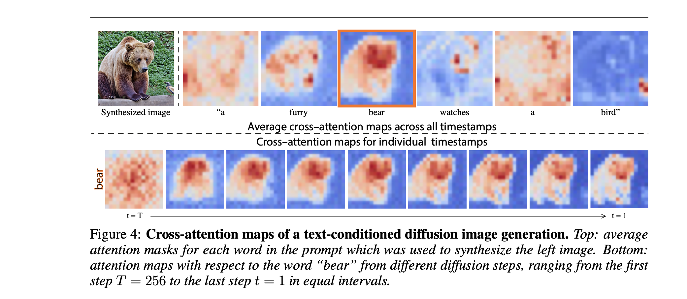

# Few shot Learning and Prompt Introduction

Few shot learning is a popular scope in nowadays machine learning. Because it only require few labeled dataset to
train a prefer model. It is useful in AI support annotation systems and tiny data ML situation.

Because few shot model only can get tiny info from dataset, for a fixed model, train in this kind of data may be not stable (i.e. sensitive when try to use different hyperparameters), some projects may occupy a
hyperparameters adjust modules.

One of popular method to implement few shot learning is from Prompt.

Prompt is a new coming information injection and auxiliary feature mode
for not only NLP but CV scope for artificial intelligence.

This article will have give brief introduction examples about these two
scope.

NLP scope:

<b>SetFit</b><br/>
[UKPLab](https://github.com/UKPLab) is a famous organization in the study of NLP scope, with its famous multimodal embedding learning library [sentence-transformers](https://github.com/UKPLab/sentence-transformers) can preform many kind of feature similarity representations in text or image. I had open a issue in its repository about the downstream works or an adapter model based on [What kind of tasks i can choose to adapt if i had trained a cross-encoder by adapter-hub ?](https://github.com/UKPLab/sentence-transformers/issues/827) there also about fintinue sentencetransformer and the developer say not yet in some times ago. Now they release a new project [setfit](https://github.com/huggingface/setfit) that use sentencetransformer in few shot learning Scene.
It also have hyperparameter search component from huggingface
```python
from transformers.trainer_utils import HPSearchBackend
```
which use TPESampler (Tree) as default with the help of [optuna](https://github.com/optuna/optuna) in [run_hp_search_optuna](https://github.com/huggingface/setfit/blob/900adcc90c700e9a5e4abb69d56233c052321633/src/setfit/integrations.py)

When discuss multilanguage support it has:
[run_fewshot_multilingual.py](https://github.com/huggingface/setfit/blob/ebee18ceaecb4414482e0a6b92c97f3f99309d56/scripts/transformers/run_fewshot_multilingual.py) use model_id as "xlm-roberta-base", When we discuss Non-English or multilanguage model
we really care about if it exist a tokenizer that segment and map
the input language favorable.<br/>
A self-tried SetFit demo in Chinese located [here](https://github.com/svjack/NLP-demos-with-translate/blob/main/setfit_text_classification_multilabel_zh.md)

<b>PaddleNLP</b><br/>
PaddleNLP introduce OpenPrompt's method to train its Few Shot learning applications, some examples can be seen in its project in [few_shot](https://github.com/PaddlePaddle/PaddleNLP/tree/0a618c70f95eeea29ac084d6cf16d26fad289dd5/examples/few_shot), which contain both English and Chinese examples.
In its [label_normalized/](https://github.com/PaddlePaddle/PaddleNLP/tree/0a618c70f95eeea29ac084d6cf16d26fad289dd5/examples/few_shot/p-tuning/label_normalized) path is the id to text mapping defined for its template. and the description of it is
 located in [task_label_description.py](https://github.com/PaddlePaddle/PaddleNLP/blob/0a618c70f95eeea29ac084d6cf16d26fad289dd5/examples/few_shot/efl/task_label_description.py).<br/>
A self-tried PaddleNLP's P-tuning Few shot classification demo in Chinese located [here](https://github.com/svjack/NLP-demos-with-translate/tree/main/ethos_to_p_tuning)

CV scope: (not a kind of prompt for train but for "edit")<br/>
<b>Stable Diffusion</b><br/>
[Stable Diffusion](https://github.com/CompVis/stable-diffusion]) is a latent text-to-image diffusion model that you can use prompt
to get a image sample from model.
[prompt-to-prompt](https://github.com/google/prompt-to-prompt) give three type of edits (Replacement Refinement and Re-weight) that change the input prompt slightly, it have some challenges as
above few shot unstable in hyperparameters choose. Below is the text from paper [PROMPT-TO-PROMPT IMAGE EDITING WITH CROSS-ATTENTION CONTROL](https://prompt-to-prompt.github.io/ptp_files/Prompt-to-Prompt_preprint.pdf)
<br/>
<b>
However, Edit- ing is challenging for these generative models, since an innate property of an edit- ing technique is to preserve some content from the original image, while in the text-based models, even a small modification of the text prompt often leads to a completely different outcome.
</b>
<br/>
It produce a cross-attention map that give every word in a prompt
  a feature reasonable representation in image.


<br>
When it comes to implement a multilanguage version of [Stable Diffusion](https://github.com/CompVis/stable-diffusion]) which is the basic of [prompt-to-prompt](https://github.com/google/prompt-to-prompt) can dive into the code [text_to_image](https://github.com/huggingface/diffusers/tree/60c384bcd2b6f0cf9569fa8999ac8f7eff98b31a/examples/text_to_image) because multilanguage version of every code is a code that change
tokenizer above fintinue version. [There](https://github.com/huggingface/diffusers/blob/60c384bcd2b6f0cf9569fa8999ac8f7eff98b31a/examples/text_to_image/train_text_to_image.py) contain code:
```python
tokenizer = CLIPTokenizer.from_pretrained(args.pretrained_model_name_or_path, subfolder="tokenizer")
text_encoder = CLIPTextModel.from_pretrained(args.pretrained_model_name_or_path, subfolder="text_encoder")
vae = AutoencoderKL.from_pretrained(args.pretrained_model_name_or_path, subfolder="vae")
unet = UNet2DConditionModel.from_pretrained(args.pretrained_model_name_or_path, subfolder="unet")
```
There are many versions of CLIP that can lookup, contains: [Multilingual-CLIP](https://github.com/FreddeFrallan/Multilingual-CLIP) and [japanese-stable-diffusion](https://github.com/rinnakk/japanese-stable-diffusion), the latter give a trainable example in [japanese-clip](https://github.com/rinnakk/japanese-clip) which implement them in japanese scene.

So i train three models on [English](https://huggingface.co/svjack/Stable-Diffusion-Pokemon-en), [Japanese](https://huggingface.co/svjack/Stable-Diffusion-Pokemon-ja) and [Chinese](https://huggingface.co/svjack/Stable-Diffusion-Pokemon-zh) and release them in my [HuggingFace Hub](https://huggingface.co/svjack), you can download it and try yourself, the training codes have pushed to https://github.com/svjack/Stable-Diffusion-Pokemon .

<div style="text-align:center">

 </div>

If you are interested in it, you can take a look at it. And compare different files to seek how i change the code to make it satisfy different languages.


